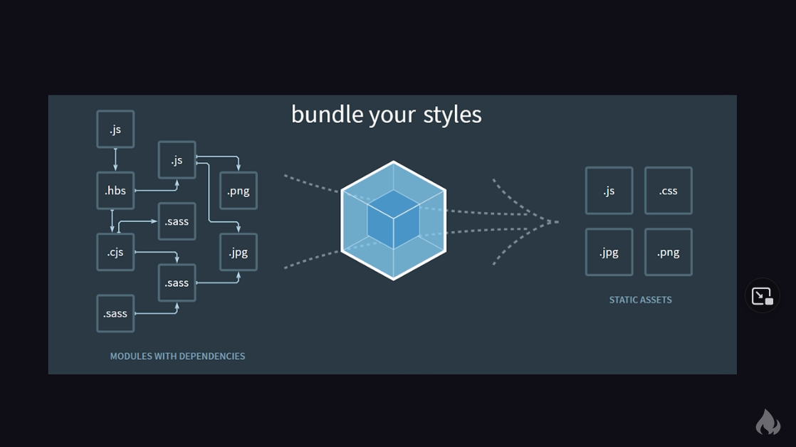

Why we use Webpack?: "Moduler Bundler"

오늘날 웹 앱들은 순수 HTML5, CSS3, JS로 개발되지 않는다

모듈화된 부분들 + 프레임워크 등 3rd Party Modules

로드 용량은 커지고, Namespace는 충돌하고, 의존성은 복잡해진다

Build

[Fireship - Webpack, Rollup, Parcel and Snowpack](https://youtu.be/5IG4UmULyoA)

`webpack.config.js`: 기본 Webpack 작동을 customize

i.e. Code Splitting

